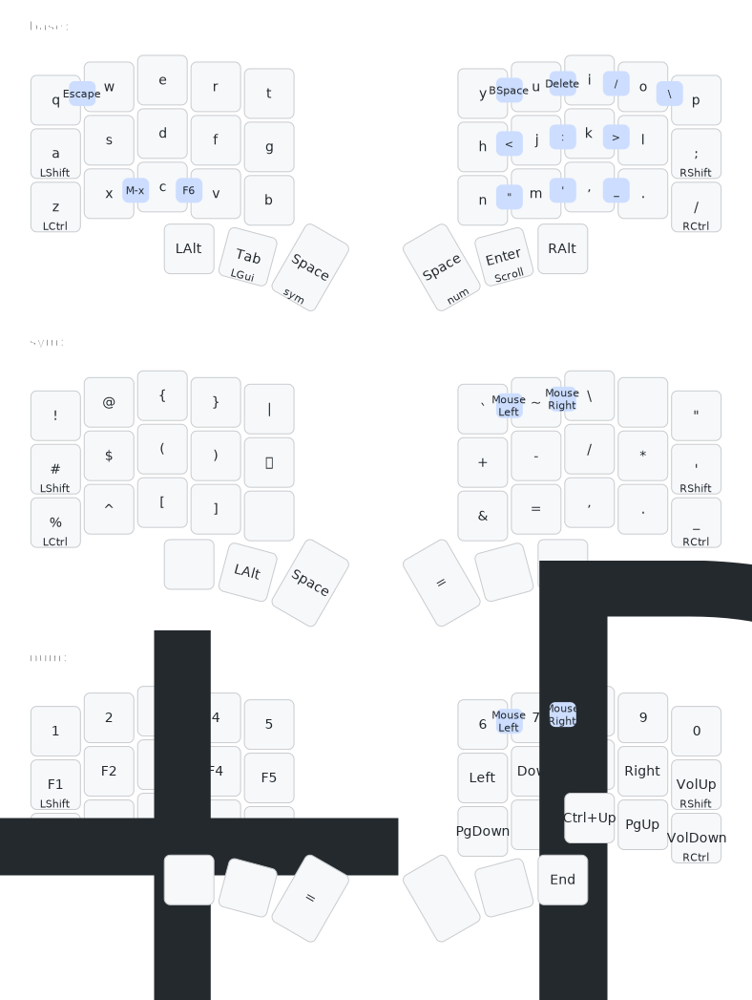

# Rust firmware for the [dilemma v2](https://github.com/Bastardkb/Dilemma)

https://github.com/simmsb/rusty-dilemma/assets/5330444/2e6345b6-a52b-436a-b9c9-535a1fc93490

## Layout

## Features

- Normal keypresses, mod taps, layers, chords, mouse keys
- Cirque trackpad support, with support for using it to scroll
- Some pretty neopixel animations (that sync between sides, and transition smoothly)
- Support for a st7789 display, using slint to render the UI
- Single firmware binary, everything works no matter which side is plugged in
- Double tapping the update button puts the mcu into dfu mode
- The device pretends to be a RP Pico and supports being put into DFU mode by
  `picotool`

## Building

You'll need cargo and picotool installed

- `cargo build --release -Zbuild-std=core,alloc,panic_abort -Zbuild-std-features=panic_immediate_abort`
  + It's fine to use just `cargo build --release` here, the extra parameters just make the binary a bit smaller.
- `picotool load -f ./target/thumbv6m-none-eabi/release/boot`
  + The bootloader only needs flashing the first time
- `picotool load -f ./target/thumbv6m-none-eabi/release/binary`
- `picotool reboot`

(You can use either the nix flake or install picotool yourself)

## Keymaps

You can use https://github.com/simmsb/keylayout to generate key layouts (and
also generate previes of them), check out the [one I use](layouts/rusty-dilemma.kl)
